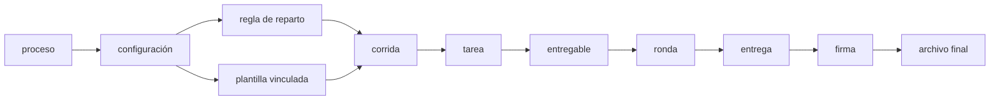

Esta sección explica **la cadena entera del dominio**: qué se declara, qué se dispara, quién debe
qué, y cómo un entregable acaba siendo un archivo firmado. Es la parte del sistema que más cuesta
al principio, y la que más tiempo hace perder cuando se entiende a medias.

Se lee **en orden**. Cada página es un eslabón, y cada eslabón deja el siguiente preparado:

## Las dos mitades, y por qué confundirlas cuesta

La cadena tiene un corte en medio que conviene ver antes que nada.

**La primera mitad se declara.** Alguien configura un proceso: a quién alcanza, en qué periodos
corre, qué entregables produce. Nada de eso existe todavía como trabajo de nadie — son reglas
esperando.

**La segunda mitad se ejecuta.** Al disparar el proceso, esas reglas se materializan en tareas y
entregables concretos, con una persona detrás y una fecha encima.

El corte importa porque **las reglas no se editan una vez disparadas**. Si se pudieran cambiar, un
documento a medio firmar cambiaría de reglas mientras lo firman.

## Una palabra sobre los nombres

Los nombres en letra de máquina son los de las **tablas y columnas reales**. No se traducen, porque
son los que verás si abres la base de datos, y la idea es que puedas contrastar cada afirmación de
estas páginas con lo que hay dentro. Al lado de cada uno va siempre qué significa en castellano.

:::note[Cómo verificar lo que lees aquí]
El esquema vigente está en `backend/database/postgres_schema.sql`, y el modelo generado desde él
—con sus ocho diagramas por dominio— en [Modelo de datos](/referencia/modelo-datos/).

Ese modelo **no se escribe: se genera**, y una puerta de CI falla si el esquema y los diagramas se
separan. Estas páginas, en cambio, **sí están escritas a mano**: si encuentras una discrepancia,
gana el esquema.
:::

## El recorrido

| # | Página | Qué responde |
|---|---|---|
| 1 | [La siembra](/modelo/siembra/) | De qué parte un sistema vacío |
| 2 | [La organización](/modelo/organizacion/) | Quién existe y dónde está sentado |
| 3 | [El proceso](/modelo/proceso/) | Qué se hace, y en qué versión de sus reglas |
| 4 | [El reparto](/modelo/reparto/) | A quién le toca cuando esto se dispare |
| 5 | [El entregable y sus ediciones](/modelo/entregable-y-ediciones/) | El libro y sus impresiones |
| 6 | [El vínculo](/modelo/vinculo/) | Qué edición usa cada configuración, y en qué modo |
| 7 | [El disparo](/modelo/disparo/) | Cuándo la declaración se convierte en trabajo |
| 8 | [El entregable concreto](/modelo/entregable-concreto/) | La unidad de trabajo real |
| 9 | [Las tenencias y el relevo](/modelo/tenencias-y-relevo/) | Quién lo debe, y qué pasa cuando cambia |
| 10 | [El documento](/modelo/documento/) | Rondas y correcciones |
| 11 | [El flujo de entrega](/modelo/flujo-de-entrega/) | Quién lo rellena y quién lo revisa |
| 12 | [El flujo de firma](/modelo/flujo-de-firma/) | Quién firma, en qué orden y en qué sitio del papel |
| 13 | [El cierre](/modelo/cierre/) | El documento final y lo que se dijo por el camino |
| 14 | [Los vocabularios de estado](/modelo/vocabularios-de-estado/) | Qué estados existen y cuáles protege la base |
| 15 | [El mapa completo](/modelo/mapa-completo/) | Todo junto, de un vistazo |
| 16 | [Lo que hoy no cierra](/modelo/lo-que-no-cierra/) | Las deudas conocidas del modelo |

:::tip[Si vienes a auditar el modelo]
Empieza por [El mapa completo](/modelo/mapa-completo/) para situarte, y luego baja a la
página del eslabón que te interese. Cada una nombra sus tablas, así que sirve de índice para ir al
esquema.
:::
