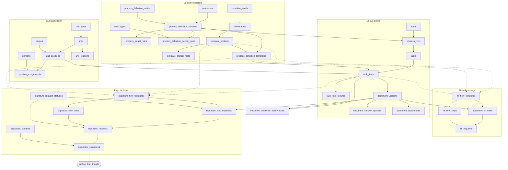

La cadena entera sin los campos, para ver la forma. Son **38 tablas** repartidas en seis grupos: la
organización (que no es parte de la cadena pero la sostiene), lo que se declara, lo que ocurre, los dos
flujos y las observaciones.

Las flechas de puntos son los **tres portadores** de una cabecera de flujo, que compiten por prioridad
—entregable, vínculo, plantilla— en vez de ser excluyentes.

## Cómo leer el mapa

**La frontera que más importa** es la de `DECL` a `EJEC`: declarar no crea trabajo. Todo lo del primer
grupo es una descripción, y el trabajo aparece en un momento concreto —el disparo, que produce la
corrida— y queda anclado a la versión de la declaración vigente entonces.

**El cuello de botella es `task_items`.** Casi todo pasa por ahí: recibe el vínculo y el puesto que lo
produce, cuelga de él la sucesión de turnos, cuelgan las rondas y cuelgan las observaciones. Y desde el
2026-08-23 **no hay nada entre el entregable y sus rondas**: la tabla `documents` que había en medio no
tenía ni una columna propia y desapareció.

**Los dos flujos son simétricos**, y en el dibujo se ve: cabecera → pasos, cabecera → instancia,
instancia → solicitudes. Las diferencias reales son tres y están en el detalle, no en la forma: la
firma añade el `slot` y el `approval_mode`, y sus estados son **tablas de catálogo** en vez de `CHECK`
— por eso `signature_request_statuses` y `signature_statuses` aparecen aquí como tablas y en el flujo
de entrega no hay equivalentes.

**Lo que el mapa no dibuja** es todo lo que queda fuera de la cadena documental: la rama de vacantes y
contratación, el chat, los expedientes y el RBAC. El esquema completo tiene 67 tablas; estas 38 son las
que van del proceso al documento firmado.
