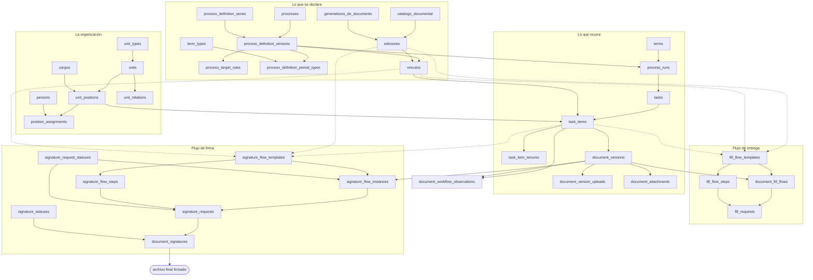

:::tip[Con todos sus campos]
Las mismas tablas y los mismos grupos, con **todas sus columnas y claves ajenas**, en
[El mapa completo, con todos sus campos](/modelo/mapa-con-campos/). Esa página se genera desde el esquema, así que
no se queda atrás; la agrupación la toma de este mapa.
:::

La cadena entera sin los campos, para ver la forma. Son **38 tablas** repartidas en seis grupos: la
organización (que no es parte de la cadena pero la sostiene), lo que se declara, lo que ocurre, los dos
flujos y las observaciones.

Las flechas de puntos son los **tres portadores** de una cabecera de flujo, que compiten por prioridad
—entregable, vínculo, plantilla— en vez de ser excluyentes.

```mermaid
flowchart TB
  subgraph ORG["La organización"]
    direction LR
    UT["unit_types"] --> U["units"]
    U --> UP["unit_positions"]
    C["cargos"] --> UP
    UP --> PA["position_assignments"]
    P["persons"] --> PA
    U --> UR["unit_relations"]
  end

  subgraph DECL["Lo que se declara"]
    direction TB
    PR["processes"] --> PDV["process_definition_versions"]
    SER["process_definition_series"] --> PDV
    PDV --> PTR["process_target_rules"]
    PDV --> PDPT["process_definition_period_types"]
    TT["term_types"] --> PDPT
    DEL["catalogo_documental"] --> TA["ediciones"]
    GEN["generadores_de_documento"] --> TA
    PDV --> PDT["vinculos"]
    TA --> PDT
  end

  subgraph EJEC["Lo que ocurre"]
    direction TB
    PDV --> RUN["process_runs"]
    TERM["terms"] --> RUN
    RUN --> T["tasks"]
    T --> TI["task_items"]
    PDT --> TI
    UP --> TI
    TI --> TEN["task_item_tenures"]
    TI --> DV["document_versions"]
    DV --> DVU["document_version_uploads"]
    DV --> DA["document_attachments"]
  end

  subgraph ENT["Flujo de entrega"]
    direction TB
    FFT["fill_flow_templates"] --> FFS["fill_flow_steps"]
    FFT --> DFF["document_fill_flows"]
    DFF --> FR["fill_requests"]
    FFS --> FR
  end

  subgraph FIR["Flujo de firma"]
    direction TB
    SFT["signature_flow_templates"] --> SFS["signature_flow_steps"]
    SFT --> SFI["signature_flow_instances"]
    SFI --> SR["signature_requests"]
    SFS --> SR
    SR --> DS["document_signatures"]
    SRS["signature_request_statuses"] --> SFI
    SRS --> SR
    SS["signature_statuses"] --> DS
  end

  TA -.-> FFT
  PDT -.-> FFT
  TI -.-> FFT
  TA -.-> SFT
  PDT -.-> SFT
  TI -.-> SFT
  DV --> DFF
  DV --> SFI
  DS --> FIN(["archivo final firmado"])
  TI --> OBS["document_workflow_observations"]
  DV --> OBS
```

## Cómo leer el mapa

**La frontera que más importa** es la de `DECL` a `EJEC`: declarar no crea trabajo. Todo lo del primer
grupo es una descripción, y el trabajo aparece en un momento concreto —el disparo, que produce la
corrida— y queda anclado a la versión de la declaración vigente entonces.

**El cuello de botella es `task_items`.** Casi todo pasa por ahí: recibe el vínculo y el puesto que lo
produce, cuelga de él la sucesión de turnos, cuelgan las rondas y cuelgan las observaciones. Y desde el
2026-08-23 **no hay nada entre el entregable y sus rondas**: la tabla `documents` que había en medio no
tenía ni una columna propia y desapareció.

**Los dos flujos son simétricos**, y en el dibujo se ve: cabecera → pasos, cabecera → instancia,
instancia → solicitudes. Las diferencias reales son tres y están en el detalle, no en la forma: la
firma añade el `slot` y el `approval_mode`, y sus estados son **tablas de catálogo** en vez de `CHECK`
— por eso `signature_request_statuses` y `signature_statuses` aparecen aquí como tablas y en el flujo
de entrega no hay equivalentes.

**Lo que el mapa no dibuja** son las otras **55 tablas** del esquema, y están todas en el
[mapa del complemento](/complemento/mapa-completo/): la rama de vacantes y contratación (8), el RBAC
(8), el chat (6), dos sueltas —`relation_unit_types` y `signature_batch_jobs`— y **31 de la
persona** fuera de `persons`. Entre esas 31 están sus documentos, correos, teléfonos y direcciones,
sus credenciales y su expediente, lo que declara de sí misma y lo que acepta, y los catálogos que
las sostienen: el geográfico —que desde el 2026-09-08 baja hasta la **parroquia**— y los vocabularios
que define cada país. Lo de la persona está explicado en [La organización](/modelo/organizacion/),
que es donde se cuenta quién existe.

No entran aquí a propósito: el mapa dibuja **la cadena**, y la cadena necesita saber *que hay una
persona*, no de cuántas formas se la puede contactar. Lo que la cadena gana de ellas son **cuatro
claves ajenas, y todas salen de `persons`**: dos a `paises` —nacionalidad y país de
nacimiento—, una a `cantones` —el de nacimiento— y una a `estados_civiles`.

El esquema completo tiene 93 tablas; estas 38 son las que van del proceso al documento firmado.
