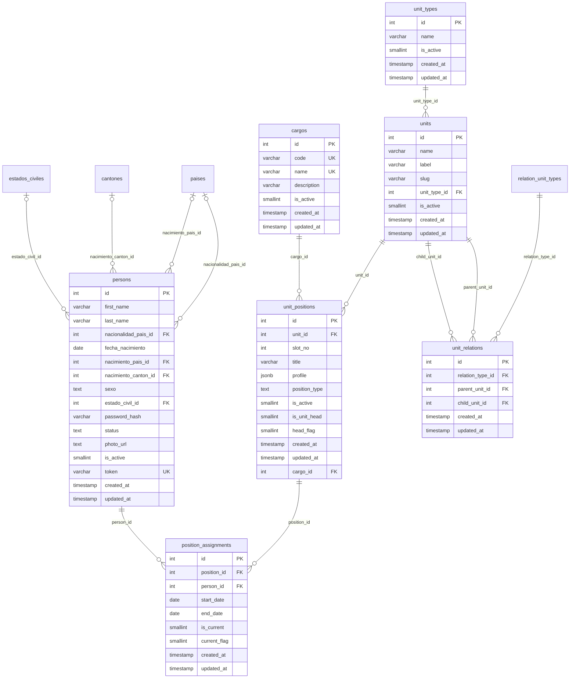
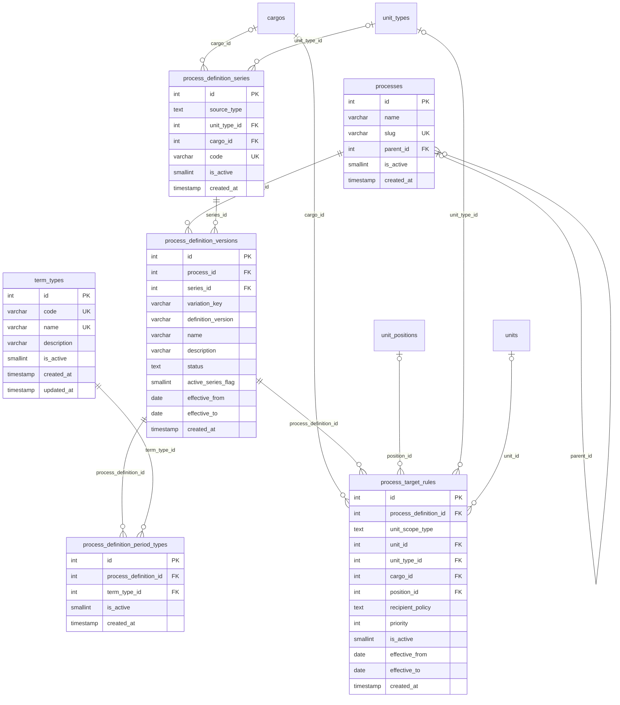
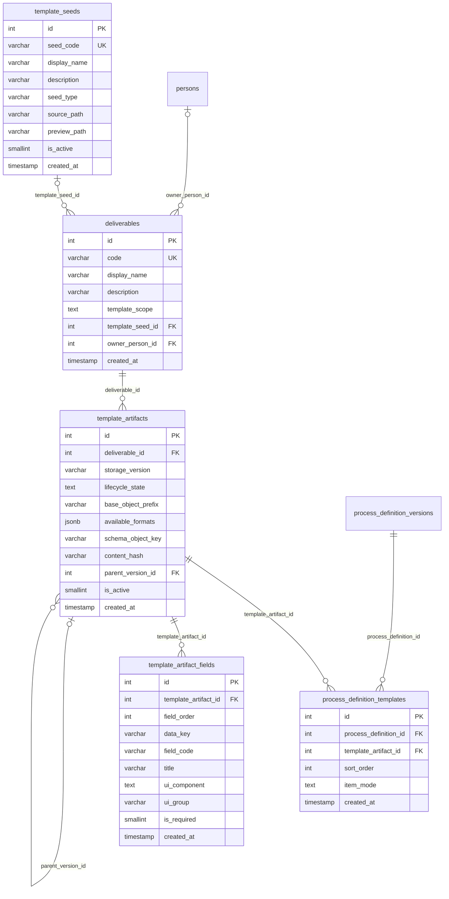
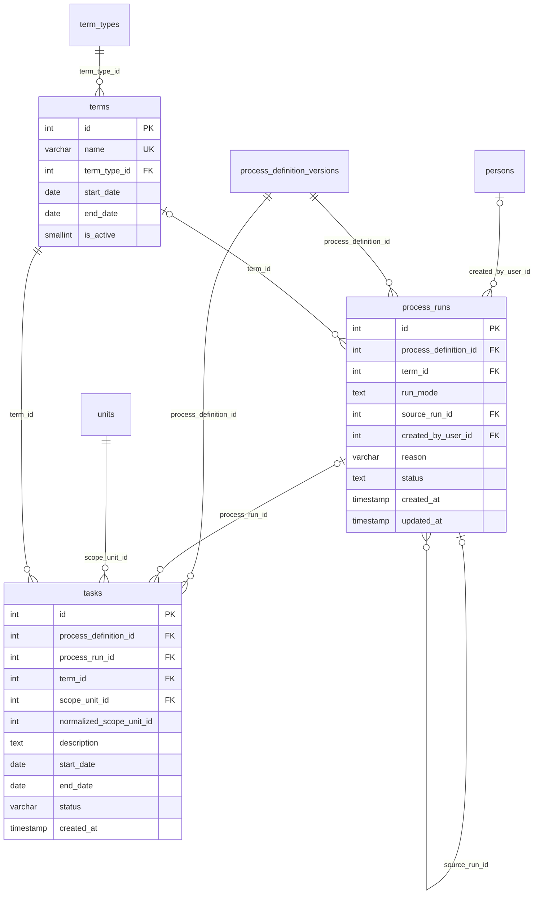
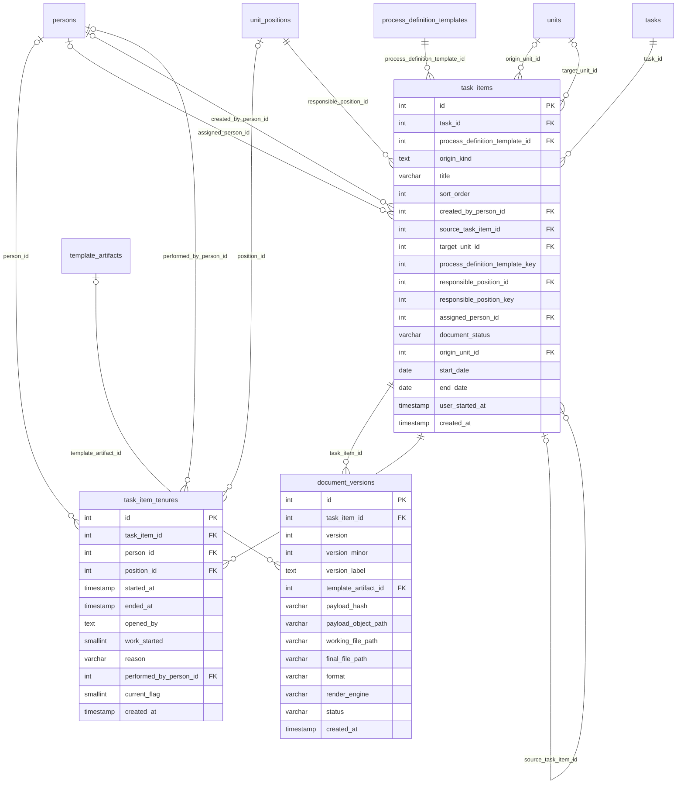
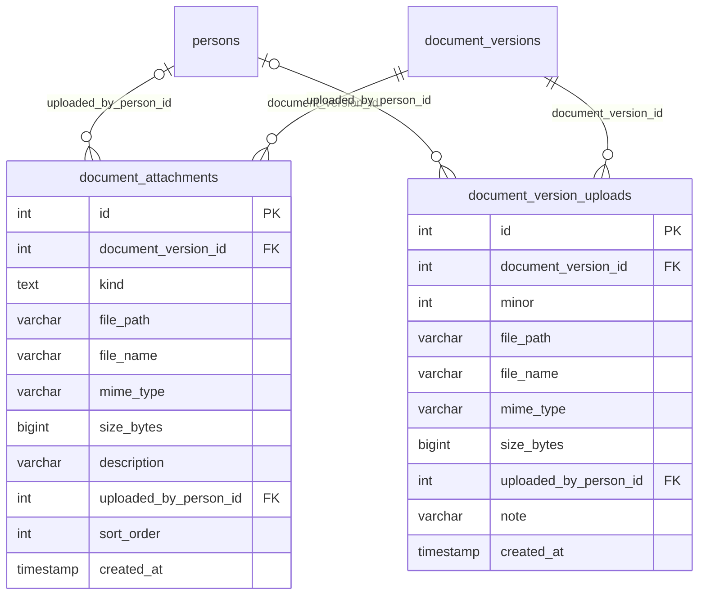
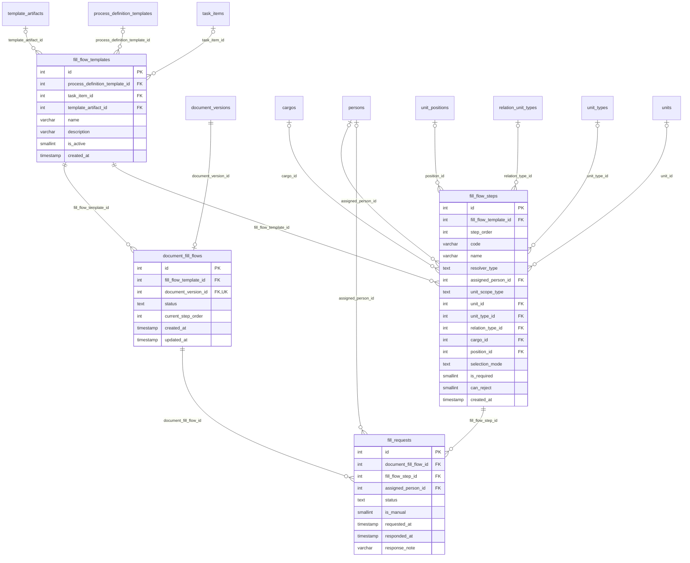
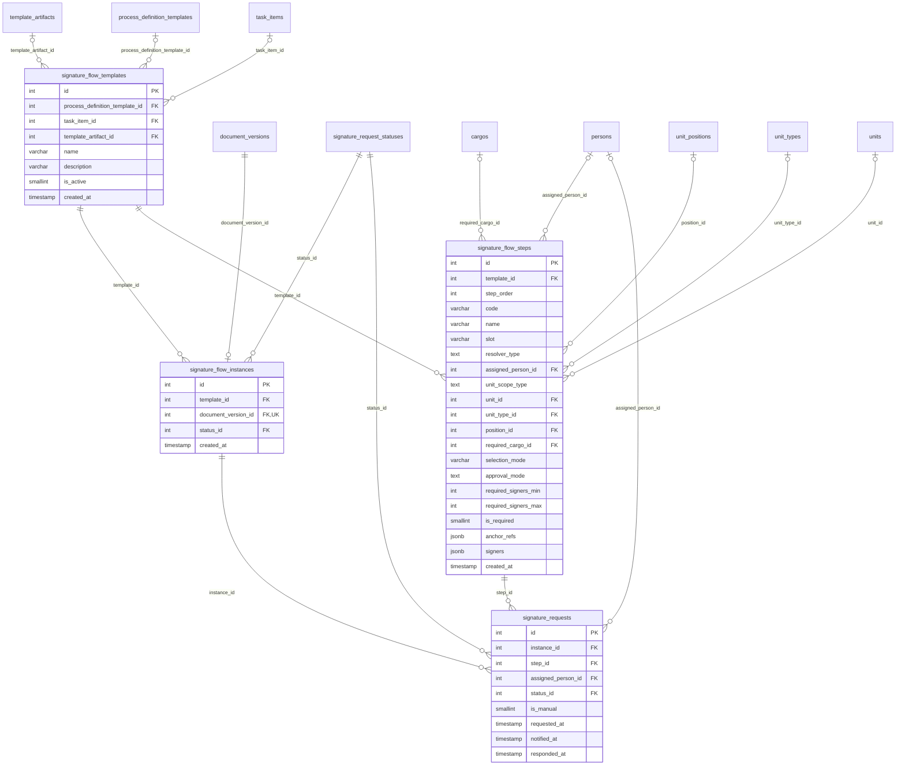
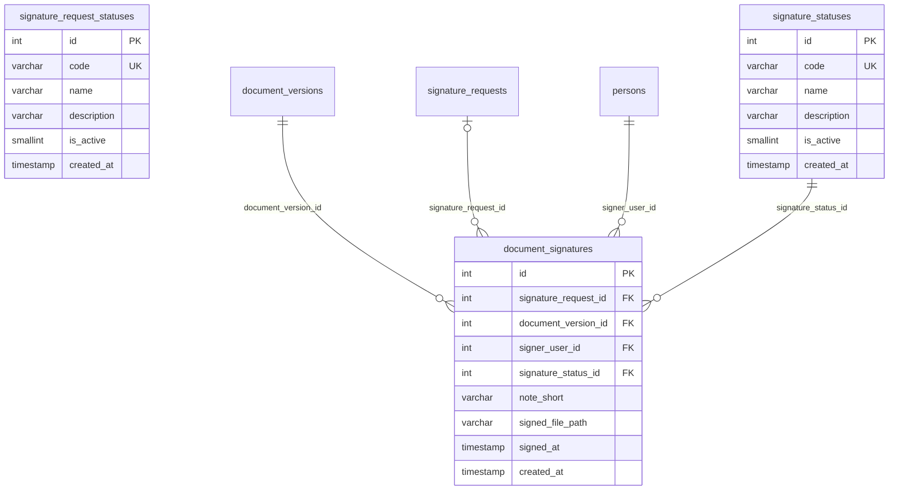
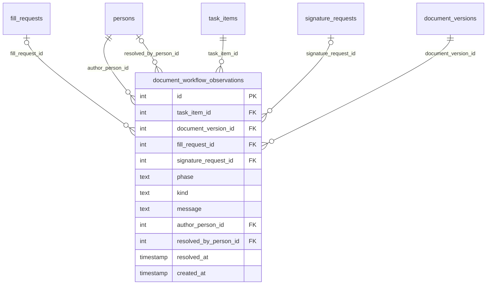

:::note[Esta página se genera: no se edita a mano]
La escribe `scripts/docs/gen-mapa-campos.mjs` cada vez que corre `bash scripts/docs/gen-dbml.sh`,
a partir del esquema, y la puerta de CI falla si se separa de él. Una edición a mano se pierde en
la siguiente regeneración.

**La agrupación sale de [el mapa completo](/modelo/mapa-completo/)**: si una tabla cambia de subgrupo allí,
cambia aquí. **Los campos y las relaciones salen del esquema, sin elegir**: están todos.
:::

**38 tablas · 367 columnas · 99 claves ajenas · 10 diagramas.**

## Cómo leerla

- Cada **caja con campos** es una tabla del grupo, con **todas** sus columnas: tipo, nombre y, si
  lo es, `PK` (clave primaria), `FK` (clave ajena) o `UK` (única).
- **Cada clave ajena se dibuja una sola vez: en el diagrama de la tabla que la guarda.** Si apunta a
  una tabla de otro diagrama, esa tabla sale como **caja vacía**; sus campos están en el suyo.
- Las claves que **llegan** desde otros diagramas se listan debajo de cada uno, en un desplegable.
  Dibujarlas también hacía ilegible cualquier grupo con una tabla a la que apunta medio esquema,
  como `persons`.
- En cada línea, `||` quiere decir que la clave ajena es obligatoria y `|o` que admite nulos; `o{`
  son varias filas y `o|` como mucho una. La etiqueta es la columna que guarda la clave.
- Un subgrupo grande va en varios diagramas seguidos, y algunos se leen de izquierda a derecha:
  se decidió midiendo la letra de cada uno, para que ninguno baje de 12 px a ancho de columna.
- Para acercar, **Ctrl + rueda** sobre el diagrama, o su botón de pantalla completa.

## La organización

**7 tablas** · 63 columnas · 12 claves ajenas propias. Apunta a `cantones`, `estados_civiles`, `paises`, `relation_unit_types`, que salen como caja vacía.

Llegan 58 claves ajenas desde otros diagramas

`aplications.person_id` → `persons` · `persona_autoidentificacion.person_id` → `persons` · `cargo_role_map.cargo_id` → `cargos` · `chat_conversations.created_by` → `persons` · `chat_conversations.scope_unit_id` → `units` · `chat_messages.sender_person_id` → `persons` · `chat_notifications.recipient_person_id` → `persons` · `chat_conversation_participants.person_id` → `persons` · `chat_message_reads.person_id` → `persons` · `contracts.person_id` → `persons` · `contracts.position_id` → `unit_positions` · `deliverables.owner_person_id` → `persons` · `direcciones.person_id` → `persons` · `document_attachments.uploaded_by_person_id` → `persons` · `document_signatures.signer_user_id` → `persons` · `document_version_uploads.uploaded_by_person_id` → `persons` · `document_workflow_observations.author_person_id` → `persons` · `document_workflow_observations.resolved_by_person_id` → `persons` · `documentos_identidad.person_id` → `persons` · `dossiers.person_id` → `persons` · `emails.person_id` → `persons` · `fill_flow_steps.cargo_id` → `cargos` · `fill_flow_steps.assigned_person_id` → `persons` · `fill_flow_steps.position_id` → `unit_positions` · `fill_flow_steps.unit_type_id` → `unit_types` · `fill_flow_steps.unit_id` → `units` · `fill_requests.assigned_person_id` → `persons` · `password_reset_codes.person_id` → `persons` · `person_certificates.person_id` → `persons` · `process_definition_series.cargo_id` → `cargos` · `process_definition_series.unit_type_id` → `unit_types` · `process_runs.created_by_user_id` → `persons` · `process_target_rules.cargo_id` → `cargos` · `process_target_rules.position_id` → `unit_positions` · `process_target_rules.unit_type_id` → `unit_types` · `process_target_rules.unit_id` → `units` · `role_assignments.person_id` → `persons` · `role_assignments.derived_from_assignment_id` → `position_assignments` · `role_assignments.unit_id` → `units` · `signature_flow_steps.required_cargo_id` → `cargos` · `signature_flow_steps.assigned_person_id` → `persons` · `signature_flow_steps.position_id` → `unit_positions` · `signature_flow_steps.unit_type_id` → `unit_types` · `signature_flow_steps.unit_id` → `units` · `signature_requests.assigned_person_id` → `persons` · `task_item_tenures.person_id` → `persons` · `task_item_tenures.position_id` → `unit_positions` · `task_items.assigned_person_id` → `persons` · `task_items.created_by_person_id` → `persons` · `task_items.origin_unit_id` → `units` · `task_items.responsible_position_id` → `unit_positions` · `task_items.target_unit_id` → `units` · `tasks.scope_unit_id` → `units` · `telefonos.person_id` → `persons` · `vacancies.position_id` → `unit_positions` · `vacancy_visibility.unit_id` → `units` · `signature_batch_jobs.user_id` → `persons` · `task_item_tenures.performed_by_person_id` → `persons`

## Lo que se declara (1 de 2)

**6 tablas** · 50 columnas · 12 claves ajenas propias. Apunta a `cargos`, `unit_positions`, `unit_types`, `units`, que salen como caja vacía.

Llegan 8 claves ajenas desde otros diagramas

`chat_conversations.process_id` → `processes` · `chat_conversations.scope_current_definition_id` → `process_definition_versions` · `chat_conversations.scope_origin_definition_id` → `process_definition_versions` · `chat_conversations.scope_process_id` → `processes` · `process_definition_templates.process_definition_id` → `process_definition_versions` · `process_runs.process_definition_id` → `process_definition_versions` · `tasks.process_definition_id` → `process_definition_versions` · `terms.term_type_id` → `term_types`

## Lo que se declara (2 de 2)

**5 tablas** · 44 columnas · 7 claves ajenas propias. Apunta a `persons`, `process_definition_versions`, que salen como caja vacía.

Llegan 6 claves ajenas desde otros diagramas

`document_versions.template_artifact_id` → `template_artifacts` · `fill_flow_templates.template_artifact_id` → `template_artifacts` · `fill_flow_templates.process_definition_template_id` → `process_definition_templates` · `signature_flow_templates.template_artifact_id` → `template_artifacts` · `signature_flow_templates.process_definition_template_id` → `process_definition_templates` · `task_items.process_definition_template_id` → `process_definition_templates`

## Lo que ocurre (1 de 3)

**3 tablas** · 27 columnas · 9 claves ajenas propias. Apunta a `persons`, `process_definition_versions`, `term_types`, `units`, que salen como caja vacía.

Llega 1 clave ajena desde otros diagramas

`task_items.task_id` → `tasks`

## Lo que ocurre (2 de 3)

**3 tablas** · 45 columnas · 14 claves ajenas propias. Apunta a `persons`, `process_definition_templates`, `tasks`, `template_artifacts`, `unit_positions`, `units`, que salen como caja vacía.

Llegan 9 claves ajenas desde otros diagramas

`document_attachments.document_version_id` → `document_versions` · `document_fill_flows.document_version_id` → `document_versions` · `document_signatures.document_version_id` → `document_versions` · `document_version_uploads.document_version_id` → `document_versions` · `document_workflow_observations.task_item_id` → `task_items` · `document_workflow_observations.document_version_id` → `document_versions` · `fill_flow_templates.task_item_id` → `task_items` · `signature_flow_instances.document_version_id` → `document_versions` · `signature_flow_templates.task_item_id` → `task_items`

## Lo que ocurre (3 de 3)

**2 tablas** · 21 columnas · 4 claves ajenas propias. Apunta a `document_versions`, `persons`, que salen como caja vacía.

## Flujo de entrega

**4 tablas** · 41 columnas · 15 claves ajenas propias. Apunta a `cargos`, `document_versions`, `persons`, `process_definition_templates`, `relation_unit_types`, `task_items`, `template_artifacts`, `unit_positions`, `unit_types`, `units`, que salen como caja vacía.

Llega 1 clave ajena desde otros diagramas

`document_workflow_observations.fill_request_id` → `fill_requests`

## Flujo de firma (1 de 2)

**4 tablas** · 43 columnas · 16 claves ajenas propias. Apunta a `cargos`, `document_versions`, `persons`, `process_definition_templates`, `signature_request_statuses`, `task_items`, `template_artifacts`, `unit_positions`, `unit_types`, `units`, que salen como caja vacía.

Llegan 2 claves ajenas desde otros diagramas

`document_signatures.signature_request_id` → `signature_requests` · `document_workflow_observations.signature_request_id` → `signature_requests`

## Flujo de firma (2 de 2)

**3 tablas** · 21 columnas · 4 claves ajenas propias. Apunta a `document_versions`, `persons`, `signature_requests`, que salen como caja vacía.

Llegan 2 claves ajenas desde otros diagramas

`signature_flow_instances.status_id` → `signature_request_statuses` · `signature_requests.status_id` → `signature_request_statuses`

## Fuera de los subgrupos

**1 tabla** · 12 columnas · 6 claves ajenas propias. Apunta a `document_versions`, `fill_requests`, `persons`, `signature_requests`, `task_items`, que salen como caja vacía.

