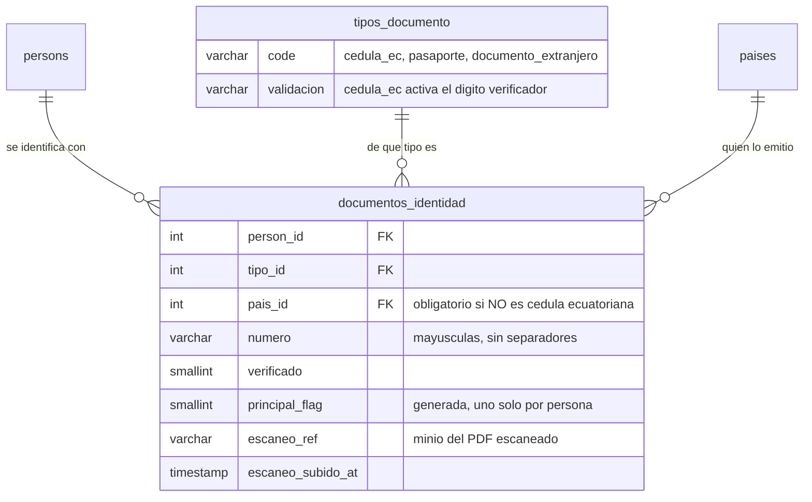
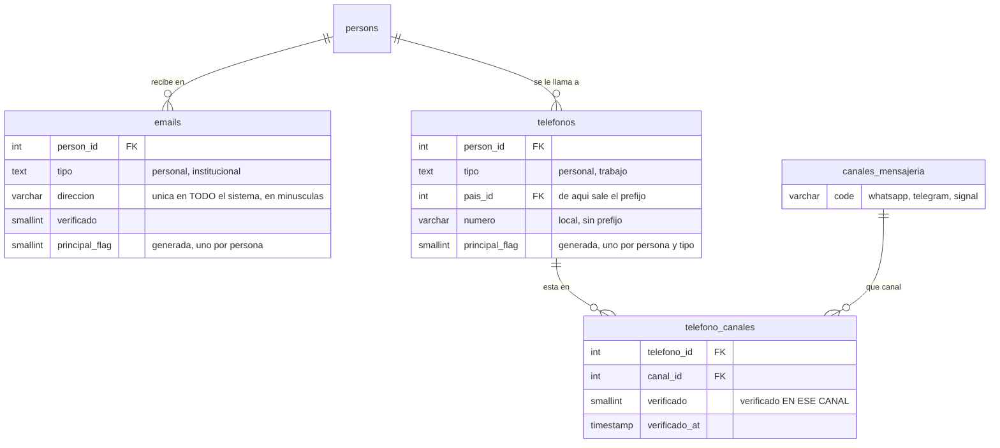
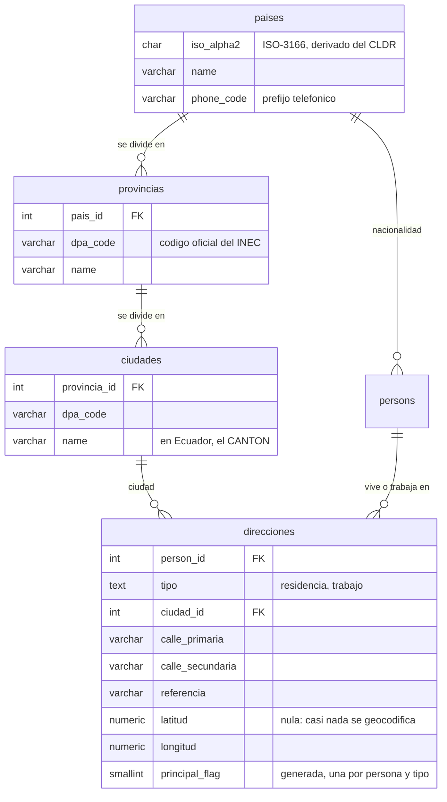
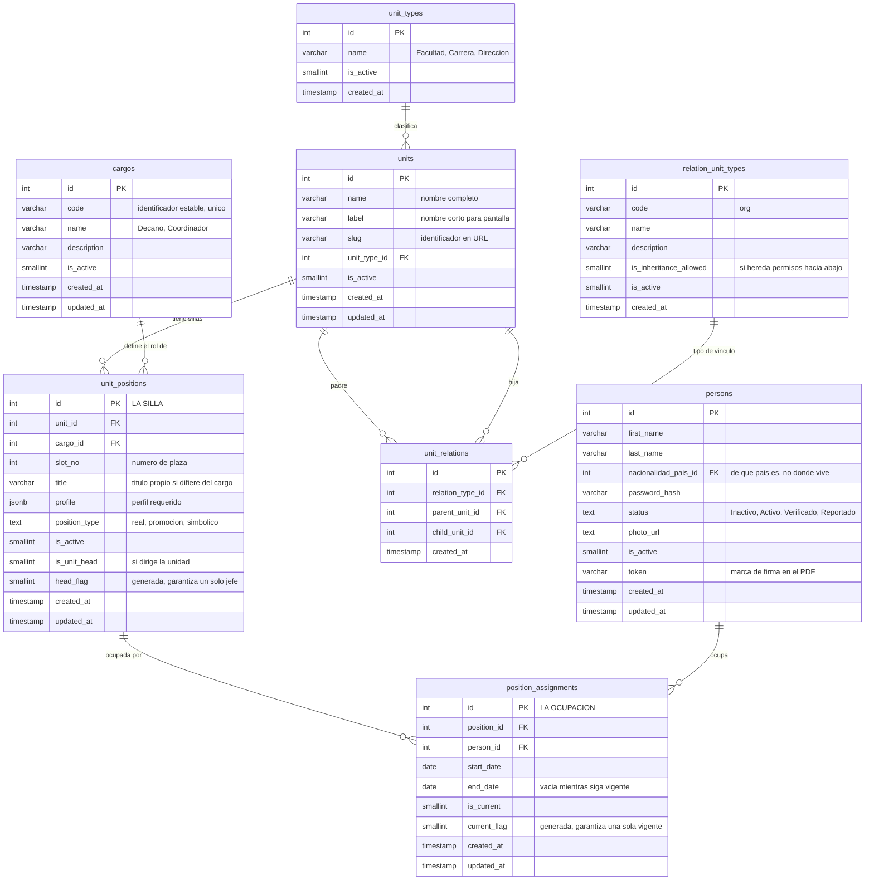

Antes de que haya procesos tiene que haber una universidad. Deasy la modela con una distinción que es
la clave de todo el sistema de responsabilidades: **la silla y quien está sentado en ella son cosas
distintas**.

## Las cuatro piezas

| | Qué es | Tabla |
|---|---|---|
| **Unidad** | Una parte de la institución: una facultad, una carrera, una dirección | `units` |
| **Cargo** | Un rol genérico («Decano», «Coordinador de carrera»). Catálogo; no pertenece a ninguna unidad | `cargos` |
| **Puesto** | **La silla**: *este* cargo *en esta* unidad, con su número de plaza. Existe aunque nadie la ocupe | `unit_positions` |
| **Ocupación** | Una persona sentada en esa silla durante un periodo | `position_assignments` |

Las unidades se relacionan entre sí formando el organigrama, y esa relación **tiene tipo propio**
(`relation_unit_types`): la orgánica —código `org`, la que siembra el propio esquema— es la jerárquica
de toda la vida, pero puede haber otras. Cada tipo declara además si **hereda permisos hacia abajo**
(`is_inheritance_allowed`).

Un puesto se identifica por `(unit_id, cargo_id, slot_no)` —«Coordinador de carrera, plaza 1, de la
Carrera de Sistemas»— y lleva un `position_type` cerrado por `CHECK` a `real`, `promocion` o
`simbolico`.

Una ocupación tiene fecha de inicio y, cuando la persona se va, fecha de fin. **Solo puede haber una
ocupación vigente por silla**, y eso no es una costumbre del código: lo impone la base y no se puede
saltar.

:::note[Por qué importa esta separación]

Porque los documentos se le deben **al puesto**, no a la persona. Cuando alguien deja el cargo, lo que
debía no desaparece ni se queda huérfano: pasa a quien ocupe esa silla después. Toda la mecánica de
relevos se apoya en esto — el ancla de un entregable es `task_items.responsible_position_id`, que es
obligatoria.

:::

## Reglas de negocio que no viven en el código

Deasy repite un mismo idioma: una **columna generada** que vale algo solo en un caso y `NULL` en el
resto, más un índice único sobre ella. Como los `NULL` no chocan entre sí en un índice único, el
índice restringe *solo* el caso que interesa.

En esta página el idioma aparece dos veces:

- `unit_positions.head_flag` + `uq_unit_head` — **un solo jefe por unidad**.
- `position_assignments.current_flag` + `uq_position_current` — **una sola ocupación vigente por
  silla**.

:::tip[El idioma se usa doce veces]

Medido contra el catálogo el **2026-08-27**: hay **catorce** índices únicos apoyados en una columna
generada, y son de **dos variantes distintas** que conviene no mezclar.

**Doce de la variante bandera** (`CASE WHEN … THEN 1 ELSE NULL END`): los dos de esta página, más una
vacante abierta por puesto, un seleccionado por vacante, una oferta enviada por postulación, una
asignación de rol vigente por `(persona, rol, unidad, origen)`, una configuración activa por
`(proceso, variación)`, un solo turno abierto por entregable (`uq_task_item_tenure_current`) y las
**cuatro** de los satélites de la persona —un correo, un teléfono, una dirección y un documento
principales—, que entraron el 2026-08-27.

**Dos de la variante COALESCE** (nunca nula): `uq_tasks_definition_term_scope` sobre
`tasks.normalized_scope_unit_id`, que da la **idempotencia del lanzamiento**, y
`uq_task_items_defined_target`, que se apoya en las dos columnas `_key` de `task_items`.

⚠️ Antes esta nota decía «nueve» y metía `uq_task_items_defined_target` entre las de bandera. Son dos
errores: la cifra se quedó vieja y ese índice es de la otra variante.

:::

Hay una tercera invariante en el organigrama que no usa ese idioma sino un índice único a secas:
`uq_unit_relations_child_type` sobre `(child_unit_id, relation_type_id)`. Dicho en cristiano, **una
unidad tiene como mucho un padre por tipo de relación**: el organigrama orgánico es un árbol, no un
grafo cualquiera.

## La persona ya no lo lleva todo encima

Hasta el **2026-08-27**, `persons` tenía **23 columnas** y dentro cabía casi todo: la cédula, el
correo, el WhatsApp, dos banderas de «verificado» y **siete** campos de dirección. Hoy tiene **once**,
y todas son de la persona: cómo se llama, de qué país es, cómo entra y si está activa.

Lo demás se fue a **seis tablas satélite**, y no por gusto de normalizar. Cada una resolvió un
problema concreto que la columna no podía:

| Tabla | Qué guarda | Qué arregla |
|---|---|---|
| `documentos_identidad` | El documento, con su **tipo** y su **país emisor** | `cedula` era una columna sola: no se sabía si «AB123456» era un pasaporte o una cédula mal tecleada, y **un extranjero no podía registrarse** |
| `tipos_documento` | El catálogo: `cedula_ec` · `pasaporte` · `documento_extranjero` | Añadir un tipo es una fila, no un cambio de esquema |
| `emails` | Los correos, con su tipo y su verificación | `email` era uno solo, y `verify_email` una bandera de la *persona* |
| `telefonos` | Los números, con su país | Igual: `whatsapp` era un número y `verify_whatsapp` una bandera |
| `canales_mensajeria` + `telefono_canales` | Qué canales tiene cada número, y **cuál está verificado** | La bandera vieja no decía verificado **en qué**: no distinguía «este número existe» de «este número tiene WhatsApp» |
| `direcciones` | La dirección, con su tipo y sus coordenadas | Había **dos modelos** que no se hablaban: `direccion` (texto libre, lo que veía `/admin`) y las seis `*_residencia`/`calle_*` que escribía el registro |

Y por debajo, un **catálogo geográfico encadenado**: `paises` → `provincias` → `ciudades`. Los países
salen del CLDR que trae Node, con su código ISO-3166; las provincias y los cantones, del
**Clasificador Geográfico Estadístico del INEC**.

### Cuatro reglas que no son de gusto

**Hay uno principal de cada cosa, y lo impone la base.** Un correo, un teléfono, un documento y una
dirección principales por persona —la dirección, una por tipo—. Es el mismo idioma de la columna
generada que usa el organigrama para el jefe de unidad. Sin eso, «manda el correo a esta persona» no
tendría respuesta.

**Cambiar el valor desverifica.** Si la verificación sobreviviera al cambio, bastaría verificar un
correo propio y luego apuntarlo a otro para heredar la confianza. Con el documento va más lejos:
además **suelta su escaneo**, porque ese PDF es del documento viejo y dejarlo colgando parecería un
respaldo que no existe.

**La unicidad de un documento es `(tipo, país, número)`, no el número.** Un número de pasaporte es
único **dentro del país que lo emite**: «AB123456» puede ser ecuatoriano *y* español. Por eso un
documento que no sea cédula ecuatoriana **exige** su país emisor.

**Se entra por cualquiera de ellos.** El acceso resuelve contra la tabla, no contra el principal:
quien se registró con pasaporte y luego declara su cédula sigue entrando con los dos. Y el número se
normaliza —mayúsculas, sin espacios ni guiones—, así que `ab-123 456` y `AB123456` son el mismo
documento.

:::caution[Dónde NO está la cédula]

En `persons`. Se retiró como columna, y con ella la unicidad global que sostenía el acceso. Si buscas
a alguien por su documento, la consulta va a `documentos_identidad`; y el organigrama, el expediente y
las rutas de firma ya no la usan como identificador.

Lo que sí valida ahora, y antes nadie: **el dígito verificador de la cédula ecuatoriana**. Es módulo
10, local y sin red. El servicio externo sigue existiendo y hace otra cosa —preguntarle al registro
civil si esa persona existe—; esto caza la errata antes de gastar la llamada.

:::

### Los diagramas de la identidad

Van **tres**, y no es capricho: en uno solo median 2966 px de ancho y salían a 7 px de letra
efectiva, por debajo del listón de legibilidad del sitio. Partidos por lo que uno busca —quién eres,
cómo se te localiza y dónde vives— se leen, y además se corresponden con las tres preguntas.

**Quién eres.** El documento, con su tipo y su país emisor:

**Cómo se te localiza.** Los correos y los teléfonos, cada canal con su propia verificación:

**Dónde vives.** La dirección y el catálogo geográfico que la hace un dato y no una redacción:

:::note[De dónde salen esas filas]

**232 países**, del CLDR que ya trae Node, con su ISO-3166 derivado por nombre. **24 provincias y 221
cantones**, del *Clasificador Geográfico Estadístico 2025* del INEC.

Y una trampa que costó encontrar: ese fichero trae **231** cantones, no 221. Los diez de más llevan
asterisco y son **históricos** —Santa Elena, Santo Domingo, La Concordia y los de Orellana aparecen
dos veces, en su provincia vieja y en la nueva—. Sin filtrarlos, el catálogo saldría con duplicados
que parecen legítimos.

Ojo también: **el nombre de una ciudad sólo es único dentro de su provincia**. Hay un cantón «Bolívar»
en Carchi y otro en Manabí, y un «Olmedo» en Loja y otro en Manabí, y ninguno lleva asterisco.

:::

:::note[Por qué el escaneo guarda una referencia y no una URL]

`documentos_identidad.escaneo_ref` guarda `minio://<bucket>/<objeto>`, no una dirección web. Una URL
pública lleva dentro el endpoint del entorno, así que mover la pila o cambiar de dominio invalidaría
todas las filas. La ruta del objeto sí es derivable —cuelga del id de la persona y del documento—,
pero **su existencia no**: una referencia vacía significa «sin escaneo», y saberlo sin preguntarle al
almacén es justo la razón de guardarla.

:::

## El diagrama, con todos sus campos

:::note[Un campo que sorprende]

`persons.token` son diez caracteres únicos por persona (`VARCHAR(10) NOT NULL UNIQUE`). No son de
seguridad: son **la marca que se escribe dentro del PDF** para que el firmador sepa exactamente en qué
página y en qué coordenadas estampar la firma de esa persona. Es el hilo que une la organización con
la firma.

:::
