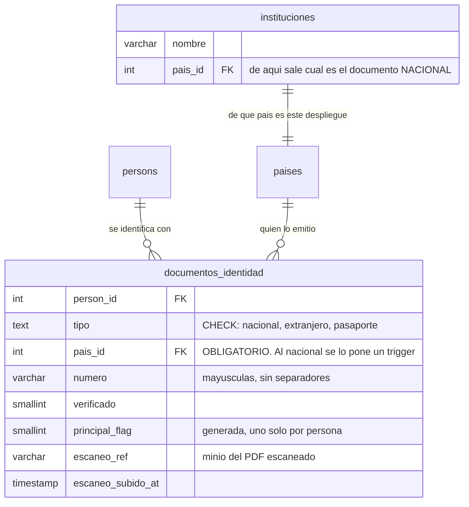
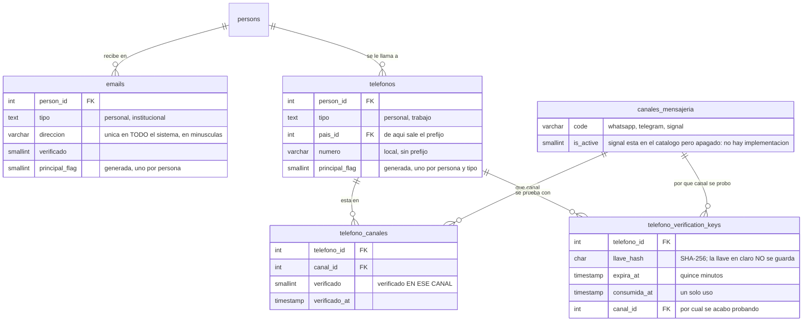
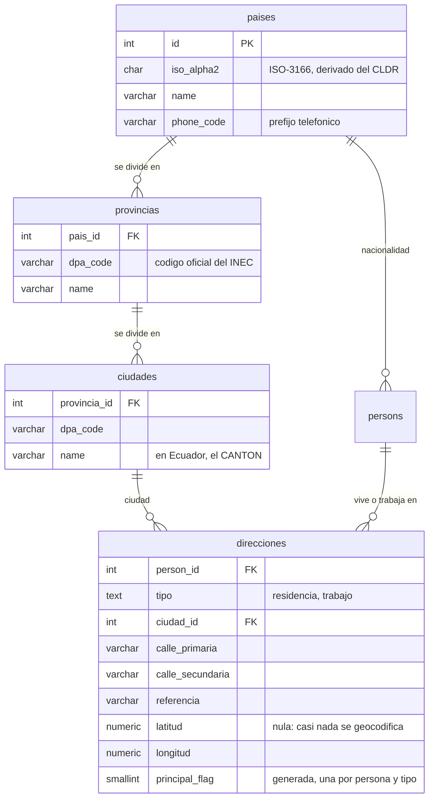
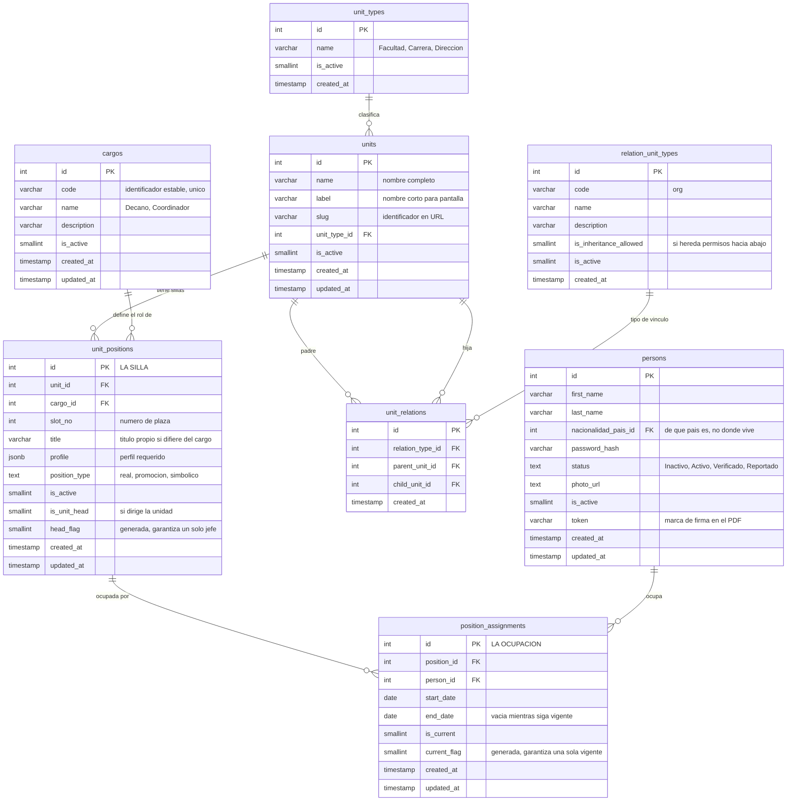

Antes de que haya procesos tiene que haber una universidad. Deasy la modela con una distinción que es
la clave de todo el sistema de responsabilidades: **la silla y quien está sentado en ella son cosas
distintas**.

## Las cuatro piezas

| | Qué es | Tabla |
|---|---|---|
| **Unidad** | Una parte de la institución: una facultad, una carrera, una dirección | `units` |
| **Cargo** | Un rol genérico («Decano», «Coordinador de carrera»). Catálogo; no pertenece a ninguna unidad | `cargos` |
| **Puesto** | **La silla**: *este* cargo *en esta* unidad, con su número de plaza. Existe aunque nadie la ocupe | `unit_positions` |
| **Ocupación** | Una persona sentada en esa silla durante un periodo | `position_assignments` |

Las unidades se relacionan entre sí formando el organigrama, y esa relación **tiene tipo propio**
(`relation_unit_types`): la orgánica —código `org`, la que siembra el propio esquema— es la jerárquica
de toda la vida, pero puede haber otras. Cada tipo declara además si **hereda permisos hacia abajo**
(`is_inheritance_allowed`).

Un puesto se identifica por `(unit_id, cargo_id, slot_no)` —«Coordinador de carrera, plaza 1, de la
Carrera de Sistemas»— y lleva un `position_type` cerrado por `CHECK` a `real`, `promocion` o
`simbolico`.

Una ocupación tiene fecha de inicio y, cuando la persona se va, fecha de fin. **Solo puede haber una
ocupación vigente por silla**, y eso no es una costumbre del código: lo impone la base y no se puede
saltar.

:::note[Por qué importa esta separación]

Porque los documentos se le deben **al puesto**, no a la persona. Cuando alguien deja el cargo, lo que
debía no desaparece ni se queda huérfano: pasa a quien ocupe esa silla después. Toda la mecánica de
relevos se apoya en esto — el ancla de un entregable es `task_items.responsible_position_id`, que es
obligatoria.

:::

## Reglas de negocio que no viven en el código

Deasy repite un mismo idioma: una **columna generada** que vale algo solo en un caso y `NULL` en el
resto, más un índice único sobre ella. Como los `NULL` no chocan entre sí en un índice único, el
índice restringe *solo* el caso que interesa.

En esta página el idioma aparece dos veces:

- `unit_positions.head_flag` + `uq_unit_head` — **un solo jefe por unidad**.
- `position_assignments.current_flag` + `uq_position_current` — **una sola ocupación vigente por
  silla**.

:::tip[El idioma se usa doce veces]

Medido contra el catálogo el **2026-08-27**: hay **catorce** índices únicos apoyados en una columna
generada, y son de **dos variantes distintas** que conviene no mezclar.

**Doce de la variante bandera** (`CASE WHEN … THEN 1 ELSE NULL END`): los dos de esta página, más una
vacante abierta por puesto, un seleccionado por vacante, una oferta enviada por postulación, una
asignación de rol vigente por `(persona, rol, unidad, origen)`, una configuración activa por
`(proceso, variación)`, un solo turno abierto por entregable (`uq_task_item_tenure_current`) y las
**cuatro** de los satélites de la persona —un correo, un teléfono, una dirección y un documento
principales—, que entraron el 2026-08-27.

**Dos de la variante COALESCE** (nunca nula): `uq_tasks_definition_term_scope` sobre
`tasks.normalized_scope_unit_id`, que da la **idempotencia del lanzamiento**, y
`uq_task_items_defined_target`, que se apoya en las dos columnas `_key` de `task_items`.

⚠️ Antes esta nota decía «nueve» y metía `uq_task_items_defined_target` entre las de bandera. Son dos
errores: la cifra se quedó vieja y ese índice es de la otra variante.

:::

Hay una tercera invariante en el organigrama que no usa ese idioma sino un índice único a secas:
`uq_unit_relations_child_type` sobre `(child_unit_id, relation_type_id)`. Dicho en cristiano, **una
unidad tiene como mucho un padre por tipo de relación**: el organigrama orgánico es un árbol, no un
grafo cualquiera.

## La persona ya no lo lleva todo encima

Hasta el **2026-08-27**, `persons` tenía **23 columnas** y dentro cabía casi todo: la cédula, el
correo, el WhatsApp, dos banderas de «verificado» y **siete** campos de dirección. Hoy tiene **once**,
y todas son de la persona: cómo se llama, de qué país es, cómo entra y si está activa.

Lo demás se fue a **cinco tablas satélite**, y no por gusto de normalizar. Cada una resolvió un
problema concreto que la columna no podía:

| Tabla | Qué guarda | Qué arregla |
|---|---|---|
| `documentos_identidad` | El documento, con su **clase**, su **país emisor** y su número | `cedula` era una columna sola: no se sabía si «AB123456» era un pasaporte o una cédula mal tecleada, y **un extranjero no podía registrarse** |
| `emails` | Los correos, con su tipo y su verificación | `email` era uno solo, y `verify_email` una bandera de la *persona* |
| `telefonos` | Los números, con su país | Igual: `whatsapp` era un número y `verify_whatsapp` una bandera |
| `canales_mensajeria` + `telefono_canales` | Qué canales tiene cada número, y **cuál está verificado** | La bandera vieja no decía verificado **en qué**: no distinguía «este número existe» de «este número tiene WhatsApp» |
| `direcciones` | La dirección, con su tipo y sus coordenadas | Había **dos modelos** que no se hablaban: `direccion` (texto libre, lo que veía `/admin`) y las seis `*_residencia`/`calle_*` que escribía el registro |

Y por debajo, un **catálogo geográfico encadenado**: `paises` → `provincias` → `ciudades`. Los países
salen del CLDR que trae Node, con su código ISO-3166; las provincias y los cantones, del
**Clasificador Geográfico Estadístico del INEC**.

### El país no está en el código: está en una fila

Hasta el **2026-08-29**, el documento nacional se llamaba `cedula_ec` y su validador colgaba del tipo.
Ecuador estaba **dentro del programa**: en un despliegue peruano, el documento nacional habría seguido
llamándose «cédula» y validándose con el dígito verificador ecuatoriano.

Hoy son tres piezas, y ninguna nombra un país:

**`instituciones`** es la primera tabla de **configuración** del sistema —antes no había ninguna— y
guarda el país de esta instalación. Se edita en `/admin`, y se lee por `GET /system/institucion`, que
es **público** como el catálogo geográfico: lo consume el **registro**, que por definición usa quien
todavía no tiene cuenta y necesita saber cómo se llama aquí el documento nacional.

No lleva restricción de fila única a propósito: es la puerta por la que entraría un modelo
multi-inquilino, y `InstitucionService.actual()` **falla si hay cero o más de una** en vez de elegir
en silencio — elegir «la primera» ante dos daría un país equivocado, y con él un validador
equivocado, sin que nadie entendiera por qué se rechaza un número.

**Las tres clases de documento son un `CHECK`**, como en `emails`, `telefonos` y `direcciones`:
`documento_nacional` · `documento_extranjero` · `pasaporte`. Son fijas, el código se ramifica con
ellas, y **un cuarto valor no debe poder crearse** porque nadie sabría qué hacer con él. Antes eran un
catálogo de tres filas con clave ajena: la única del grupo que lo hacía así.

**El validador y el nombre local se resuelven POR PAÍS**, en un registro de código
(`documentosPorPais.js`). No hay una entrada por país del mundo: hay **una por país con regla**, y las
demás caen a una comprobación genérica. «Cédula (Ecuador)» no se guarda — se **compone** del país; en
un despliegue peruano la misma pantalla dice «DNI (Perú)» sin tocar una línea.

:::note[El pasaporte es siempre alfanumérico]

Mande el país lo que mande. Los números de pasaporte no llevan dígito verificador público —los que
hay viven en la MRZ, no en el número—, y aplicarles el validador del país rechazaría pasaportes
ecuatorianos perfectamente válidos por no tener diez dígitos.

:::

### Cuatro reglas que no son de gusto

**Hay uno principal de cada cosa, y lo impone la base.** Un correo, un teléfono, un documento y una
dirección principales por persona —la dirección, una por tipo—. Es el mismo idioma de la columna
generada que usa el organigrama para el jefe de unidad. Sin eso, «manda el correo a esta persona» no
tendría respuesta.

**Cambiar el valor desverifica.** Si la verificación sobreviviera al cambio, bastaría verificar un
correo propio y luego apuntarlo a otro para heredar la confianza. Con el documento va más lejos:
además **suelta su escaneo**, porque ese PDF es del documento viejo y dejarlo colgando parecería un
respaldo que no existe.

**La unicidad de un documento es `(tipo, país, número)`, no el número.** Un número de pasaporte es
único **dentro del país que lo emite**: «AB123456» puede ser ecuatoriano *y* español. Por eso el país
emisor es **obligatorio** — al documento nacional no se le pregunta, se lo pone un trigger desde
`instituciones`, pero se guarda igual.

**El número se normaliza** —mayúsculas, sin espacios ni guiones—, así que `ab-123 456` y `AB123456`
son el mismo documento.

:::caution[El documento NO es una llave]

En `persons` no está: se retiró como columna el 2026-08-27. Y desde el **2026-08-29 tampoco sirve
para entrar** — el acceso es **sólo por correo**.

No se quitó por la unicidad, aunque la consulta del acceso la ignoraba —resolvía `numero = ?` a
secas, así que podía emparejar a la persona equivocada—. Se quitó por la **estabilidad**: un
pasaporte se renueva **con número nuevo**, y quien entrara con él perdería su acceso al renovarlo. El
correo lo controla la persona y no caduca.

El documento sigue siendo el dato legal de la identidad, y sirve para **recuperar el correo** si se
acompaña de la contraseña (`POST /users/recuperar-correo`).

:::

### Los diagramas de la identidad

Van **tres**, y no es capricho: en uno solo median 2966 px de ancho y salían a 7 px de letra
efectiva, por debajo del listón de legibilidad del sitio. Partidos por lo que uno busca —quién eres,
cómo se te localiza y dónde vives— se leen, y además se corresponden con las tres preguntas.

**Quién eres.** El documento, con su clase y su país emisor:


```mermaid
erDiagram
  persons ||--o{ documentos_identidad : "se identifica con"
  paises ||--o{ documentos_identidad : "quien lo emitio"
  instituciones ||--|| paises : "de que pais es este despliegue"

  documentos_identidad {
    int person_id FK
    text tipo "CHECK: nacional, extranjero, pasaporte"
    int pais_id FK "OBLIGATORIO. Al nacional se lo pone un trigger"
    varchar numero "mayusculas, sin separadores"
    smallint verificado
    smallint principal_flag "generada, uno solo por persona"
    varchar escaneo_ref "minio del PDF escaneado"
    timestamp escaneo_subido_at
  }
  instituciones {
    varchar nombre
    int pais_id FK "de aqui sale cual es el documento NACIONAL"
  }
```

**Cómo se te localiza.** Los correos y los teléfonos, cada canal con su propia verificación:


```mermaid
erDiagram
  persons ||--o{ emails : "recibe en"
  persons ||--o{ telefonos : "se le llama a"
  telefonos ||--o{ telefono_canales : "esta en"
  canales_mensajeria ||--o{ telefono_canales : "que canal"
  telefonos ||--o{ telefono_verification_keys : "se prueba con"
  canales_mensajeria ||--o{ telefono_verification_keys : "por que canal se probo"

  emails {
    int person_id FK
    text tipo "personal, institucional"
    varchar direccion "unica en TODO el sistema, en minusculas"
    smallint verificado
    smallint principal_flag "generada, uno por persona"
  }
  telefonos {
    int person_id FK
    text tipo "personal, trabajo"
    int pais_id FK "de aqui sale el prefijo"
    varchar numero "local, sin prefijo"
    smallint principal_flag "generada, uno por persona y tipo"
  }
  telefono_canales {
    int telefono_id FK
    int canal_id FK
    smallint verificado "verificado EN ESE CANAL"
    timestamp verificado_at
  }
  canales_mensajeria {
    varchar code "whatsapp, telegram, signal"
    smallint is_active "signal esta en el catalogo pero apagado: no hay implementacion"
  }
  telefono_verification_keys {
    int telefono_id FK
    char llave_hash "SHA-256; la llave en claro NO se guarda"
    timestamp expira_at "quince minutos"
    timestamp consumida_at "un solo uso"
    int canal_id FK "por cual se acabo probando"
  }
```

### Cómo se prueba que un número es tuyo

Un teléfono no se verifica solo, y **la verificación es por canal**: que un número tenga WhatsApp no
dice que tenga Telegram. Por eso la bandera vive en `telefono_canales` y no en `telefonos`.

El circuito tiene una regla que lo explica entero: **escribe siempre el usuario, nunca nosotros**.
El sistema compone un enlace con una llave dentro —`t.me/<bot>?start=<llave>`, `wa.me/<numero>?text=<llave>`,
—, y espera. Cuando el mensaje llega, el transporte ya
prueba de qué número viene.

**Quién compara es parte del diseño.** El canal aporta un hecho que su transporte prueba —«este
número mandó esta llave»— y **el backend dicta el veredicto**, porque es el único que sabe de qué
país es el número guardado. Hacerlo al revés no es un matiz: comparando sin el país sólo se puede
mirar la cola del número, y entonces `+51 99 111 2233` y `+593 99 111 2233` son el mismo teléfono.
Con eso bastaría para registrar el número de otra persona y verificarlo desde una línea propia.

⚠️ **Y de ahí que un teléfono sin país no se pueda verificar.** `telefonos.pais_id` admite nulo, y
sin prefijo no hay comparación internacional posible. Lo mismo vale para un número guardado **con el
prefijo dentro** de `numero` —esa columna guarda la parte local— porque compone `593593…`, que no es
el teléfono de nadie. Los dos casos se avisan **al pedir la llave**, no al final del camino: un fallo
del dato no se le cuenta a nadie como un fallo suyo.

De ahí salen tres propiedades que no son casualidad:

- **Ningún canal cuesta por mensaje.** No enviamos nada, así que no existe el ataque de coste que
  sufre cualquier sistema que manda un mensaje a un número que le dicten.
- **Ninguno de los dos regala el número, y es lo que los hace válidos.** Telegram no lo entrega: el
  bot lo pide con un botón, y hay que exigir que el contacto sea de quien escribe — si no, cualquiera
  reenvía la tarjeta de otra persona. WhatsApp entrega un identificador de conversación que desde 2026
  suele ser **opaco** (`@lid`), del que no se deduce el teléfono: hay que preguntárselo a WhatsApp y
  **rechazar si no contesta con un número**.
- **Lo que ambos conservan es quién afirma el número: la plataforma, sobre una sesión que ella misma
  autenticó** — no quien escribe. Ésa es la propiedad que hace válida una verificación entrante.

:::caution[Por qué no hay SMS, y no lo habrá]
El catálogo tuvo una cuarta fila, `sms`, y **se descartó el 2026-09-01**. La razón es justo la
propiedad de arriba: **el SMS entrante no la tiene**. Su número de origen lo rellena el emisor y es
falsificable desde una pasarela SMPP ([10.1145/3615667](https://doi.org/10.1145/3615667)), lo que se
ha llevado hasta un ataque completo ([10.1145/3696011](https://doi.org/10.1145/3696011)).

Aplicado aquí el ataque es directo **y somos nosotros quienes damos la llave**: alguien registra una
cuenta declarando el teléfono de otro, recibe una llave válida y la devuelve falsificando el origen.
No da acceso a ninguna cuenta —hace falta la contraseña— pero **suplanta la identidad en el alta y
bloquea el número de la víctima**. Y es peor contra un número **extranjero**, que es justo a quien
este sistema atiende a propósito: la falsificación internacional funcionó en **todas** las operadoras
del estudio.

Se suma que **en Ecuador no existe alquilar un número que reciba** (Twilio: *"Two-way SMS supported:
No"*; las operadoras sustituyen el remitente por un número local). Y la alternativa saliente —mandar
nosotros un código— cuesta por mensaje, abre el fraude de bombeo de SMS y **no aporta nada a quien ya
puede usar WhatsApp o Telegram**.
:::

De la llave se guarda **sólo su huella SHA-256**, nunca el texto. Se elige SHA-256 y no bcrypt a
propósito: aquí hace falta **buscar por la llave** que llega, y una huella con sal no se puede buscar.
No es una contraseña —dura quince minutos, se usa una vez y es aleatoria de 256 bits—, así que lo que
bcrypt protege (adivinar a fuerza bruta un secreto elegido por una persona) no aplica.

## Si un canal se cae y nadie mira — `canales_bitacora`

Hay una pantalla que enseña cómo están los canales de mensajería. **Arregló que el estado mintiera;
no arregló que nadie mire.** El 2026-08-31 el servicio estuvo **trece horas** parado: la información
habría estado disponible todo ese tiempo, para quien hubiera abierto la pantalla — y nadie la abrió,
porque nadie sospechaba.

**`canales_bitacora` guarda una fila por CAMBIO de estado**, no por comprobación: se mira cada
minuto, y anotar cada vuelta serían 1 440 filas al día por canal para decir «sigue bien». Un `hasta`
nulo significa «sigue así ahora mismo».

```
canal      'telegram' · 'whatsapp' · 'servicio'
salud      sano · degradado · «sin vincular» · bloqueado · caido
desde      cuándo empezó ·  hasta  cuándo dejó de estarlo (nulo = ahora)
```

⚠️ **`servicio` es un canal más, y es el que importaba aquel día.** Es el propio microservicio: si
**no contesta**, eso es un estado y hay que poder contarlo. Sin esa fila, un servicio muerto se vería
como «no ha cambiado nada» — que es exactamente el silencio de las trece horas.

:::tip[Lo que contesta, y la pantalla no]
**«¿Cuánto llevaba roto?»** La pantalla enseña el ahora; la bitácora, el rato. Es la única pregunta
que un diseño por eventos habría respondido igual de bien — con la diferencia de que **un proceso
muerto no puede mandar eventos**, y preguntando su silencio sí queda anotado.
:::

Y de aquí sale el aviso: cuando un canal lleva **más de cinco minutos** mal, se avisa **una vez** —
por correo y por notificación— a quien tenga el permiso `channels.read`. Una vez, no una por vuelta:
un vigilante que avisa de más deja de leerse, y entonces el aviso que importaba se pierde entre los
que no.

⚠️ **El aviso nunca va por Telegram ni por WhatsApp**, aunque el sistema sepa hablar por ahí: el
fallo que hay que notificar es justo el que impide notificarlo.

## Lo que se acepta al registrarse — `documentos_legales` y `consentimientos`

Al crear una cuenta hay que aceptar **dos cosas, y por separado**: los **términos de uso** y el
**tratamiento de datos personales**.

⚠️ **No es una decisión de diseño: lo impone el Art. 8 de la LOPDP**, que exige que el consentimiento
sea **específico** y que, *«cuando se pretenda fundar el tratamiento […] para una pluralidad de
finalidades»*, **conste que se otorga para todas ellas**. Una sola casilla para las dos cosas no
cumple.

Y hay una razón que se ve mejor en el reverso: **los términos son un contrato** (base legal: Art.
7.5) y **el tratamiento de datos es consentimiento** (Art. 8). El segundo **se puede revocar**; el
primero no funciona así. Con una casilla única, revocar una revocaría la otra.

### `documentos_legales` — el índice; el texto vive en MinIO

```
clase              'terminos_de_uso' · 'tratamiento_de_datos'
version            'v1'                    ← la versión de NEGOCIO: lo que alguien aceptó
estado             draft · published · retired
contenido_hash     SHA-256 ← lo que hace demostrable QUÉ decía
bucket             dónde vive el texto ahora mismo
object_key         terminos_de_uso/v1.md
object_version_id  la VERSIÓN DE OBJETO ← se lee por aquí, nunca por la clave
```

⚠️ **La tabla no guarda el texto: lo indexa.** Desde el 2026-09-02 el contenido vive en MinIO, en
**dos buckets** con propósitos opuestos:

| Bucket | | Qué guarda |
|---|---|---|
| `…-legal-borradores` | versionado, **mutable** | los `draft`. Cada guardado deja una versión: ése es el **historial de edición** |
| `…-legal` | versionado + **bloqueo COMPLIANCE** | los `published` y `retired`. **Lo que entra no sale** — ni con la cuenta raíz |

**Publicar es copiar los bytes exactos** del borrador al archivo, releerlos **por su versión de
objeto**, comparar la huella y sólo entonces sellar la fila. Si la huella no cuadra, no se publica.

:::caution[Por qué `object_version_id` y no basta la clave]
El bloqueo de objetos protege **la versión, no el nombre**. Está medido: un objeto bloqueado **se
puede sobrescribir** —la versión vieja sobrevive intacta, pero quien lea *«el objeto que hay en esa
clave»* recibe lo nuevo—, y un borrado normal deja un marcador que lo hace **desaparecer del
listado**.

Por eso el sistema lee **siempre por `object_version_id`**. Sin esa columna, la inmutabilidad del
archivo no serviría de nada: la prueba seguiría ahí, pero nadie la estaría leyendo.
:::

⚠️ **Y hay dos ejes de versión que no se confunden**: la versión de **objeto** (MinIO) cuenta *cómo
evolucionó el borrador* —cuarenta guardados, cuarenta versiones—; la versión de **negocio** (`v1`,
`v2`) cuenta *qué aceptó esta persona* — cuarenta guardados, **una** fila.

**Sólo puede haber una versión publicada por clase**, o «qué aceptó» tendría dos respuestas.

⚠️ **`retired` no es borrar.** Una versión retirada **se conserva para siempre**: hay gente cuya
prueba de consentimiento apunta a ella.

### `consentimientos` — la prueba

```
person_id · documento_id · aceptado_at · ip · revocado_at
```

⚠️ **Hasta el 2026-09-02 esto no existía.** Había una casilla en el formulario que se validaba **en
el navegador** y moría ahí: no viajaba al servidor y ninguna tabla la recibía. Una validación de
JavaScript **no prueba nada** — se salta con la consola abierta.

:::caution[Lo que la ley pide, y por qué la huella es la pieza clave]
El **Art. 5 del Reglamento** dice que el consentimiento *«deberá ser **demostrado** por el
responsable que lo obtiene, cuando así sea requerido por la autoridad competente»*. Demostrar son
**cuatro** cosas: **quién**, **a qué**, **cuándo** y **qué decía el texto**.

La cuarta es la que se olvida, y sin ella las otras tres no valen: guardar «aceptó la versión 2» no
prueba nada si nadie puede demostrar qué decía la versión 2. Por eso se guarda **la huella del
texto**, y no sólo su número de versión.
:::

:::note[Y por qué NO hay clave ajena a `persons`]
Parece un descuido y es deliberado. La **Ley (Art. 18.4)** y el **Reglamento (Art. 11.2)** dicen que
la eliminación **no procede** cuando los datos son necesarios *«para la formulación, el ejercicio o
la defensa de reclamaciones»* — y la prueba de que alguien consintió **es exactamente eso**.

Con una clave ajena, borrar a la persona sería imposible o se llevaría la prueba por delante. Sin
ella, **la fila sobrevive a la persona**, que es lo que la norma permite. Del resto de sus datos no
se conserva nada por este motivo.
:::

## Cuántas veces se puede intentar — `intentos_limitados`

Hay una tabla que no guarda datos de nadie y sin embargo protege a todos: **`intentos_limitados`**
apunta *qué se intentó* y *contra qué se cuenta*, y nada más.

```
accion       'login' · 'validar_cedula' · 'registro'…
sujeto       una IP · un correo+ip · un person_id
ocurrido_at  cuándo
```

**Lo que se cuenta importa más que el número**, y ahí hay dos formas clásicas de equivocarse:

- **Sólo por IP** — una institución sale a internet **por NAT**, así que el campus entero comparte
  una IP pública. «Cinco intentos por IP» deja fuera a toda una facultad al quinto despiste de
  cualquiera.
- **Sólo por cuenta** — entonces el limitador **es el arma**: quien sepa tu correo te bloquea
  fallando adrede.

Por eso el sujeto **se elige por acción**, y en el acceso es el **par correo + IP**: ataca a quien de
verdad está fallando, sin castigar al vecino de red ni permitir bloquear una cuenta ajena. Y **nunca
se bloquea**: se responde `429` con `Retry-After` y se olvida, porque un bloqueo persistente es una
denegación de servicio que se le regala a cualquiera.

Dos detalles que explican la forma de la tabla:

- **`sujeto` es un texto y no una clave ajena.** Lo que se cuenta cambia con la acción, y hay
  acciones **anónimas** en las que no existe ninguna fila a la que apuntar.
- **Sólo entra lo que se frena**, y en el acceso **sólo los fallos**. Registrar cada petición
  doblaría las escrituras del sistema para no usarlas; contar los aciertos castigaría a quien
  trabaja.

:::caution[Vive en la base, y no es por comodidad]
Un contador en memoria del proceso **dejaría de proteger en cuanto hubiera dos instancias del
backend**: cada una contaría su mitad. Hoy hay una sola —y está fijada en el `compose` a propósito,
porque el tiempo real también lo exige— pero el contador ya está donde tiene que estar para el día
que deje de serlo.
:::

**Pedir una llave nueva borra la anterior.** Si pides otra es porque la primera no te sirvió, y dejar
dos vivas duplica lo que hay que adivinar sin darte nada.

Y el estado de una llave **no es un sí o un no, son cuatro**: válida, desconocida, caducada y
consumida. Se distinguen porque al usuario le dicen cosas distintas — «este enlace no vale» le hace
revisar lo que hizo; «caducó» y «ya la usaste» le dicen que repita **sin cambiar nada**.

**Dónde vives.** La dirección y el catálogo geográfico que la hace un dato y no una redacción:


```mermaid
erDiagram
  paises ||--o{ provincias : "se divide en"
  provincias ||--o{ ciudades : "se divide en"
  ciudades ||--o{ direcciones : "ciudad"
  persons ||--o{ direcciones : "vive o trabaja en"
  paises ||--o{ persons : "nacionalidad"

  direcciones {
    int person_id FK
    text tipo "residencia, trabajo"
    int ciudad_id FK
    varchar calle_primaria
    varchar calle_secundaria
    varchar referencia
    numeric latitud "nula: casi nada se geocodifica"
    numeric longitud
    smallint principal_flag "generada, una por persona y tipo"
  }
  paises {
    int id PK
    char iso_alpha2 "ISO-3166, derivado del CLDR"
    varchar name
    varchar phone_code "prefijo telefonico"
  }
  provincias {
    int pais_id FK
    varchar dpa_code "codigo oficial del INEC"
    varchar name
  }
  ciudades {
    int provincia_id FK
    varchar dpa_code
    varchar name "en Ecuador, el CANTON"
  }
```

:::note[De dónde salen esas filas]

**232 países**, del CLDR que ya trae Node, con su ISO-3166 derivado por nombre. **24 provincias y 221
cantones**, del *Clasificador Geográfico Estadístico 2025* del INEC.

Y una trampa que costó encontrar: ese fichero trae **231** cantones, no 221. Los diez de más llevan
asterisco y son **históricos** —Santa Elena, Santo Domingo, La Concordia y los de Orellana aparecen
dos veces, en su provincia vieja y en la nueva—. Sin filtrarlos, el catálogo saldría con duplicados
que parecen legítimos.

Ojo también: **el nombre de una ciudad sólo es único dentro de su provincia**. Hay un cantón «Bolívar»
en Carchi y otro en Manabí, y un «Olmedo» en Loja y otro en Manabí, y ninguno lleva asterisco.

:::

:::note[Por qué el escaneo guarda una referencia y no una URL]

`documentos_identidad.escaneo_ref` guarda `minio://<bucket>/<objeto>`, no una dirección web. Una URL
pública lleva dentro el endpoint del entorno, así que mover la pila o cambiar de dominio invalidaría
todas las filas. La ruta del objeto sí es derivable —cuelga del id de la persona y del documento—,
pero **su existencia no**: una referencia vacía significa «sin escaneo», y saberlo sin preguntarle al
almacén es justo la razón de guardarla.

:::

## El diagrama, con todos sus campos


```mermaid
erDiagram
  unit_types ||--o{ units : "clasifica"
  units ||--o{ unit_positions : "tiene sillas"
  cargos ||--o{ unit_positions : "define el rol de"
  units ||--o{ unit_relations : "padre"
  units ||--o{ unit_relations : "hija"
  relation_unit_types ||--o{ unit_relations : "tipo de vinculo"
  unit_positions ||--o{ position_assignments : "ocupada por"
  persons ||--o{ position_assignments : "ocupa"

  unit_types {
    int id PK
    varchar name "Facultad, Carrera, Direccion"
    smallint is_active
    timestamp created_at
  }
  units {
    int id PK
    varchar name "nombre completo"
    varchar label "nombre corto para pantalla"
    varchar slug "identificador en URL"
    int unit_type_id FK
    smallint is_active
    timestamp created_at
    timestamp updated_at
  }
  relation_unit_types {
    int id PK
    varchar code "org"
    varchar name
    varchar description
    smallint is_inheritance_allowed "si hereda permisos hacia abajo"
    smallint is_active
    timestamp created_at
  }
  unit_relations {
    int id PK
    int relation_type_id FK
    int parent_unit_id FK
    int child_unit_id FK
    timestamp created_at
  }
  cargos {
    int id PK
    varchar code "identificador estable, unico"
    varchar name "Decano, Coordinador"
    varchar description
    smallint is_active
    timestamp created_at
    timestamp updated_at
  }
  unit_positions {
    int id PK "LA SILLA"
    int unit_id FK
    int cargo_id FK
    int slot_no "numero de plaza"
    varchar title "titulo propio si difiere del cargo"
    jsonb profile "perfil requerido"
    text position_type "real, promocion, simbolico"
    smallint is_active
    smallint is_unit_head "si dirige la unidad"
    smallint head_flag "generada, garantiza un solo jefe"
    timestamp created_at
    timestamp updated_at
  }
  position_assignments {
    int id PK "LA OCUPACION"
    int position_id FK
    int person_id FK
    date start_date
    date end_date "vacia mientras siga vigente"
    smallint is_current
    smallint current_flag "generada, garantiza una sola vigente"
    timestamp created_at
    timestamp updated_at
  }
  persons {
    int id PK
    varchar first_name
    varchar last_name
    int nacionalidad_pais_id FK "de que pais es, no donde vive"
    varchar password_hash
    text status "Inactivo, Activo, Verificado, Reportado"
    text photo_url
    smallint is_active
    varchar token "marca de firma en el PDF"
    timestamp created_at
    timestamp updated_at
  }
```

:::note[Un campo que sorprende]

`persons.token` son diez caracteres únicos por persona (`VARCHAR(10) NOT NULL UNIQUE`). No son de
seguridad: son **la marca que se escribe dentro del PDF** para que el firmador sepa exactamente en qué
página y en qué coordenadas estampar la firma de esa persona. Es el hilo que une la organización con
la firma.

:::
