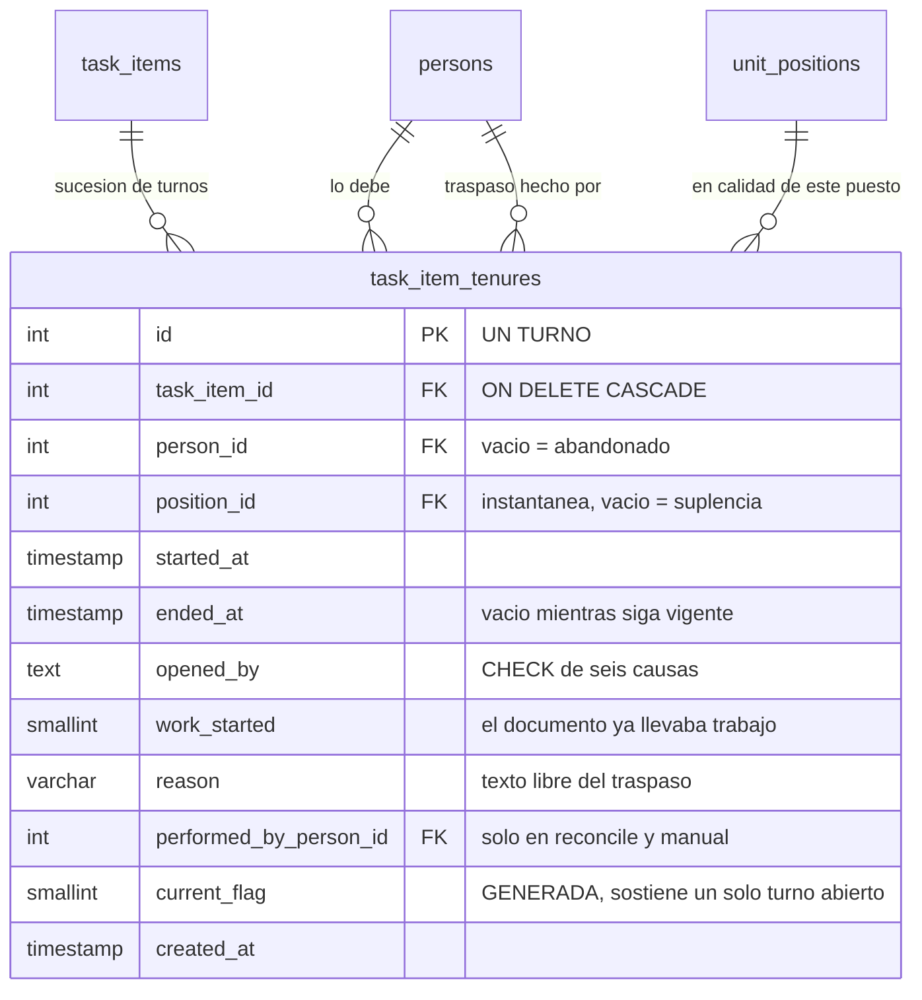

«Quién debe este documento» no es un dato fijo: es una **sucesión de turnos**. La persona A lo debe
desde marzo hasta que deja el cargo en julio; la persona B lo debe desde julio.

Cada turno es una fila de `task_item_tenures`: quién (`person_id`), en calidad de qué puesto
(`position_id`), desde cuándo (`started_at`) y hasta cuándo (`ended_at`). **Solo puede haber un turno
abierto por entregable**, y esta vez lo garantiza la base: `current_flag` es una columna generada que
vale `1` mientras `ended_at IS NULL` y `NULL` en cuanto se cierra, y
`uq_task_item_tenure_current (task_item_id, current_flag)` hace imposible tener dos abiertas.

Ese turno abierto es el responsable vigente, y es lo que alimenta la caché
`task_items.assigned_person_id` de la página anterior.

:::note[Dos `NULL` que significan cosas concretas]

**`person_id` vacío es el abandono.** Si el responsable deja el puesto y no hay sucesor, se cierra su
turno y se abre otro **sin persona**. Así «¿desde cuándo está abandonado esto?» pasa a ser un campo
(`started_at`) y no un cálculo.

**`position_id` vacío es una suplencia.** El puesto se guarda como instantánea, no como copia del
ancla `task_items.responsible_position_id`: un turno cerrado es inmutable y por eso no puede
envejecer. Difiere del ancla en el caso legítimo del traspaso a mano, donde la persona responde sin
ocupar el puesto — y entonces se queda vacío.

:::

## Por qué se abrió cada turno

Cada turno guarda su causa en `opened_by`, con un `CHECK` de **seis** valores, y esa lista es en sí
misma el mapa de todas las formas en que puede cambiar un responsable:

| Causa | Cuándo se emite | Quién la emite |
|---|---|---|
| `original` | el primero, al crearse el entregable | trigger `trg_task_items_after_insert` |
| `occupancy_start` | alguien se sentó en el puesto | triggers de `position_assignments` |
| `occupancy_end` | el ocupante se fue y el puesto quedó vacío | trigger de `position_assignments` |
| `position_deactivated` | el puesto se desactivó | trigger `trg_unit_positions_after_update` |
| `reconcile` | una revisión de oficio realineó el responsable | `taskAssignment.js`, a petición |
| `manual` | un traspaso hecho a propósito por alguien | `handoverTaskItem()` |

`performed_by_person_id` **solo se rellena en los dos últimos**: en un relevo automático no lo hizo
nadie, y `opened_by` ya dice la causa.

:::caution[La causa `manual` no se acepta del cliente]

El traspaso a mano fija `'manual'` en el código y no la toma del cuerpo de la petición. Antes venía de
un parámetro, así que quien llamaba podía declarar su traspaso como `occupancy_end` y dejar en la
bitácora una causa que no ocurrió. En una tabla de auditoría eso es lo único que no puede pasar.

:::

## La tenencia se abre sola

Hay cinco caminos que insertan en `task_items` —dos del lanzamiento automático, dos de la tarea ad hoc
y las réplicas—, y parchear los cinco es exactamente como se perdió el dato antes: uno se olvida. Por
eso el turno inicial lo abre un trigger `AFTER INSERT` sobre `task_items`, y ahí no puede olvidarse
ninguno.

## Un campo pequeño que responde una pregunta grande

`work_started` se sella al abrir el turno —igual que `position_id`, es instantánea y no se recalcula—
y dice si **el documento ya llevaba trabajo dentro** en ese momento. Se calcula como
`CASE WHEN ti.user_started_at IS NULL THEN 0 ELSE 1 END`, y `user_started_at` se sella una sola vez,
cuando alguien arranca un paso de entrega.

Distingue «relevé algo que nadie había tocado» de «relevé algo a medias», que es justo lo que pregunta
una auditoría y lo que el modelo anterior no sabía responder.

:::caution[Hasta dónde llega el relevo automático]

El traspaso automático solo alcanza a los entregables cuyo `document_status` está en esta lista:

`Inicial` · `Pendiente de llenado` · `En proceso` · `Observado` · `Listo para firma`

Es decir, **mientras el documento no haya entrado en fase de firma**. A partir de ahí no se mueve
solo: un documento que ya está siendo firmado tiene gente convocada con solicitudes a su nombre y no
puede cambiar de dueño sin que alguien lo decida.

La lista está **duplicada**: en JavaScript como `DOCUMENT_RELAYABLE_STATUSES`
(`backend/services/documents/DocumentStateService.js`) y literalmente dentro del SQL de los triggers.
Que no se separen lo vigila `DocumentStateService.test.js`, que **lee el fichero del esquema** y
compara.

Y hay una excepción más dentro de la lista: el relevo por ocupación no toca un entregable que alguien
**ya abrió** (`user_started_at IS NULL`). Nadie le quita a nadie un documento que está escribiendo.

:::

## Las solicitudes siguen al responsable

Cuando se abre un turno, el trigger `trg_task_item_tenures_sync` hace tres cosas en la misma
transacción: realinea las solicitudes de entrega pendientes, realinea las de firma pendientes, y
actualiza la caché `task_items.assigned_person_id`.

Sin eso el entregable cambiaba de manos pero el trabajo no: el guard de la solicitud dice
literalmente «No puedes operar una solicitud de entrega asignada a otro usuario», así que quien
llegaba recibía un 403 sobre su propio entregable y quien se fue era el único que técnicamente podía
actuar.

Tres precisiones que importan:

1. **La regla es «alinear al vigente», no «mover de X a Y».** Un relevo pasa por un estado intermedio
   sin persona —se cierra el turno del que se va, se abre uno abandonado, y luego el del que llega—.
   Con «mover de X a Y» la solicitud llegaba a `NULL` en el primer paso y en el segundo ya no
   coincidía con nadie: se quedaba huérfana. Alinear es además idempotente, que es lo que quieres en
   un trigger que corre por cinco caminos.
2. **Solo alcanza a los pasos resueltos por `task_assignee`**, o sea a lo que está a nombre de alguien
   *por ser el responsable*. Un paso por cargo nombra a quien ocupe ese cargo —otra persona, otro
   puesto— y no tiene que ver con este relevo; uno de `specific_person` nombra a alguien a propósito y
   heredarlo sería falsearlo. Y solo viajan las solicitudes **sin responder**.
3. **En firma se es más conservador todavía.** Además del `resolver_type` hay que mirar el JSONB
   `signature_flow_steps.signers`, que puede traer resolutores por firmante que la columna no refleja.
   Ante la duda no se mueve: mover mal una firma es peor que no moverla.

## Desactivar un puesto no es quedarse sin ocupante

La diferencia hace daño: un entregable huérfano por vacante espera a alguien que **va a venir**; uno
anclado a un puesto desactivado espera a alguien que **no existe**. Desde el 2026-08-23 desactivar un
puesto cierra las tenencias de sus entregables relevables y abre una sin persona con
`opened_by = 'position_deactivated'` —una causa que llevaba en el vocabulario desde su creación sin un
solo emisor—.

Lo que **no** hace es reasignar. El modelo no dice qué sustituye a un puesto desactivado —no hay «se
fusionó con» ni «sus funciones pasan a»—, así que elegir sucesor sería adivinar. Los entregables
afectados se listan para el jefe de la unidad, que decide.

:::note[Lo que esto reemplazó]

Antes «quién lo lleva» vivía en tres copias y dos se pudrían: `task_items.assigned_person_id` (viva),
`documents.owner_person_id` (la movía uno de los cuatro relevos) y `task_assignments` (**no la movía
ninguno**). Y ninguna podía guardar una sucesión: `task_assignments` tenía índice único
`(task_id, position_id)`, o sea una sola fila por puesto. El historial vivía aparte, en
`task_item_handovers`, como eventos («de A a B el día T»).

Eventos y periodos son isomorfos, pero los periodos responden directas las preguntas que hace este
sistema —y sobre todo dejan que «un solo responsable vigente» sea un **índice** y no una convención—.
Las tres tablas viejas están eliminadas y no vuelven.

:::
