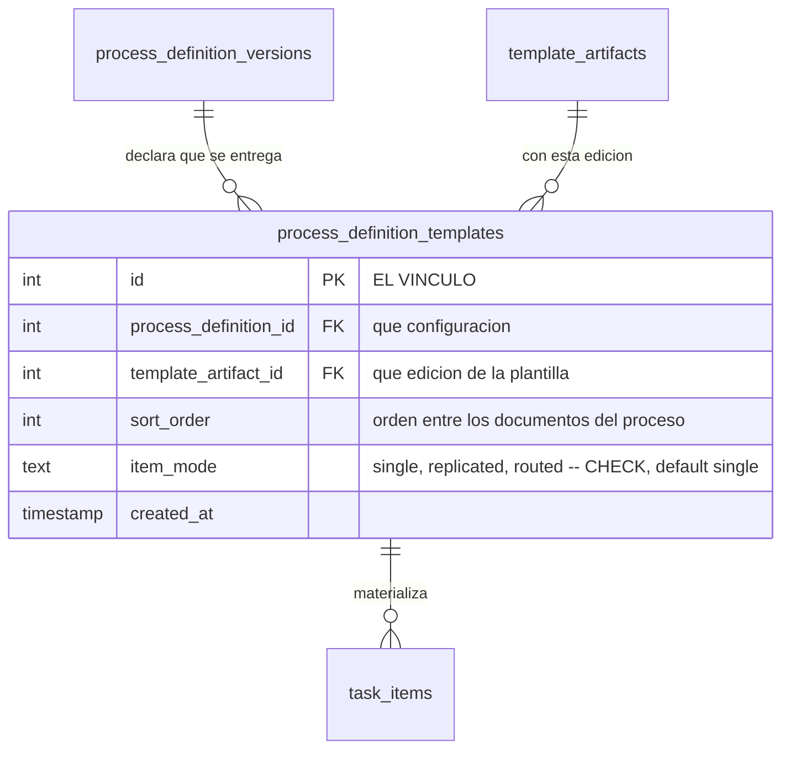

El **vínculo** (`process_definition_templates`) es la frase que cierra la mitad declarativa: *«en
esta configuración del proceso, se entrega este documento, usando esta edición de la plantilla, de
esta manera»*.

Es una tabla pequeña y hace mucho. Además de unir configuración (`process_definition_id`) con
edición (`template_artifact_id`), guarda el **orden** en que aparecen los documentos de un proceso
(`sort_order`) y, sobre todo, el **modo** (`item_mode`).

## Los tres modos, que no son variantes técnicas sino tres formas de trabajar

`item_mode` tiene un `CHECK` con tres valores, y por defecto vale `single`.

| Modo | Flujo | Cuántos entregables | Cuándo se decide quién entrega y quién firma |
|---|---|---|---|
| `single` | predefinido en la plantilla | uno por puesto alcanzado, al disparar | en la autoría de la plantilla |
| `replicated` | predefinido en la plantilla | los que cree el responsable, con su etiqueta | en la autoría de la plantilla |
| `routed` | **no hay** | los que se creen a mano | **al instanciar**, en runtime |

- **Único** (`single`) — el documento y su recorrido están decididos de antemano. Al dispararse el
  proceso aparece *un* entregable por puesto alcanzado, ya con su flujo de entrega y de firma
  puestos. Es el caso del informe que todos los coordinadores deben entregar igual. **Es el único
  modo que el lanzamiento materializa solo**: `ensureTaskItemsForTaskTargets()` filtra
  explícitamente por `item_mode === 'single'`.
- **Replicado** (`replicated`) — el recorrido está decidido, pero la cantidad no. El responsable
  crea tantas copias como necesite, cada una con su etiqueta (`task_items.title`), y todas heredan
  el mismo recorrido. Es el caso de «un acta por cada reunión que hayas tenido».
- **Abierto** (`routed`) — no hay recorrido predefinido. Quien lo usa **define en el momento** quién
  entrega y quién firma. Es el modo del «Proceso por defecto», y es lo que permite «hazme el informe
  de este evento y que lo firme el decano» sin que nadie haya configurado nada antes.

:::note[El modo es del vínculo, no de la plantilla]

`item_mode` es una columna de la tabla que **une**, no de `template_artifacts`. Su único índice
único es `uq_process_definition_templates (process_definition_id, template_artifact_id)`: la misma
edición puede vincularse a varias configuraciones, y **cada vínculo lleva su propio modo**.

O sea que una misma plantilla puede usarse de forma rígida en un proceso y de forma abierta en otro
sin necesidad de duplicarla. Es una propiedad del modelo que conviene no perder.

:::

## Dos consecuencias del modo que no se ven en la tabla

**Publicar exige flujo, salvo en `routed`.** Al publicar una edición se comprueba que tenga al menos
un paso de flujo de entrega; la comprobación se omite si la edición está vinculada **solo** en modo
`routed`, porque en ese modo el flujo no se autora, se define al enviar.

**El modo viaja con el clon, y hubo que arreglarlo.** Versionar una configuración copia sus
vínculos, y `item_mode` es `NOT NULL DEFAULT 'single'`: dejarla fuera de la copia no daba error,
convertía en `single` —en silencio— todo vínculo `routed` o `replicated`. Como clonar es lo que hace
la actualización guiada de plantillas, cada actualización deshacía el modo. Le pasó al «Proceso por
defecto» en la base de dev, cuyo vínculo original decía `routed` y el de la configuración activa
decía `single`. Hoy `cloneProcessDefinitionChildren()`
(`backend/services/admin/processes/processDefinitionVersion.js`) selecciona e inserta `item_mode`
explícitamente. Si añades una columna de datos a esta tabla, añádela también ahí.

## Qué cuelga del vínculo aguas abajo

El vínculo no desaparece al dispararse el proceso: cada entregable concreto guarda de qué vínculo
nació (`task_items.process_definition_template_id`), y esa referencia forma parte de su identidad.
El detalle está en [El entregable concreto](/modelo/entregable-concreto/).

